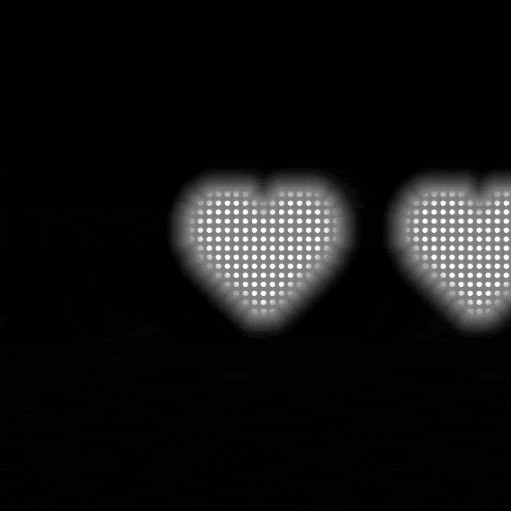
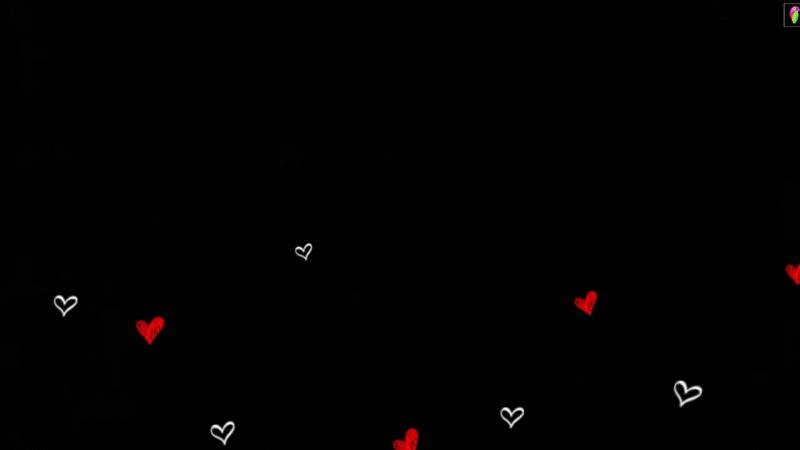
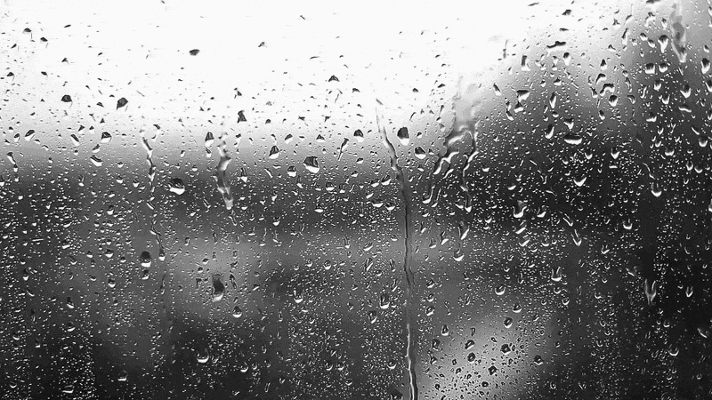
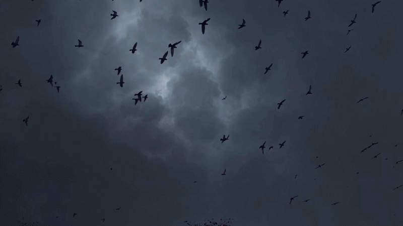
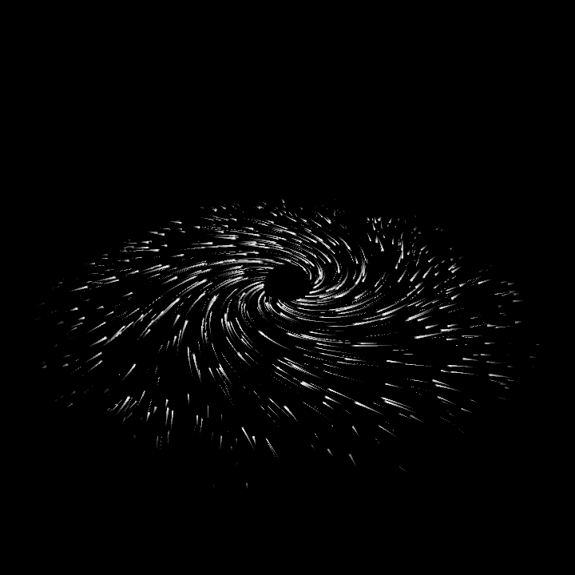
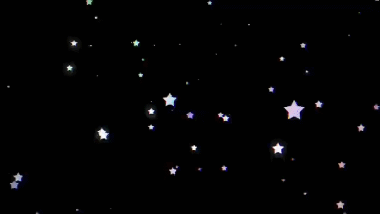
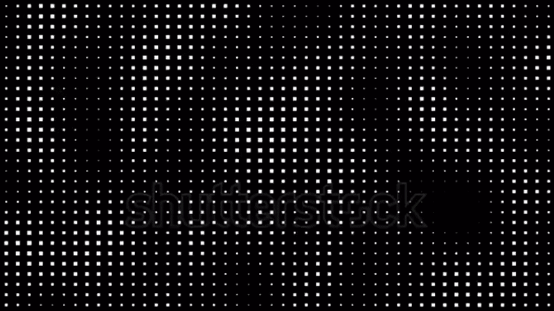
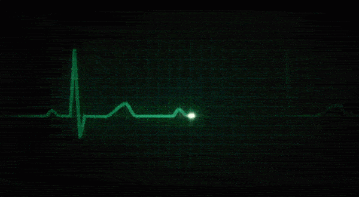
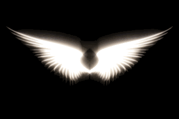

# QS-Background-Heder-images & jif
This repository  contains assets of  images and jif for heder images in QS panel , heder images in qs panel is a custimazation feature in custom romes , by which we can add any images and jif to our quick settings panel. 

## Themes Gallery
| Theme | Preview | Download |
| :--- | :---: | :---: |
| **Black Flames** |  | [Download 01_black_flames.gif](https://github.com/Sampath2417k/QS-Background-Heder-images/raw/main/01_black_flames.gif?download=1) |
| **Eyes** |  | [Download 02_eyes.gif](https://github.com/Sampath2417k/QS-Background-Heder-images/raw/main/02_eyes.gif?download=1) |
| **Pixel heart** |  | [Download 03_Pixel_heart.gif](https://github.com/Sampath2417k/QS-Background-Heder-images/raw/main/03_Pixel_heart_0.1.gif?download=1) |
| **Crown** |  | [Download 04_crown.gif](https://github.com/Sampath2417k/QS-Background-Heder-images/raw/main/04_crown.gif?download=1) |
| **GOST (COD)** |  | [Download GOST (COD)](https://github.com/Sampath2417k/QS-Background-Heder-images/raw/main/jif/gost.gif?download=1) |
| **Spiderman Novear** |  | [Download spiderman-novear](https://github.com/Sampath2417k/QS-Background-Heder-images/raw/main/jif/spiderman_novear.gif?download=1) |
| **Pixel heart white** |  | [Download Pixel heart white](https://github.com/Sampath2417k/QS-Background-Heder-images/raw/main/jif/Pixel_heart_white.gif?download=1) |
| **Heart rain** |  | [Download Heart rain](https://github.com/Sampath2417k/QS-Background-Heder-images/raw/main/jif/heart_rain.gif?download=1) |
| **Rain on glass** |  | [Download Rain on glass](https://github.com/Sampath2417k/QS-Background-Heder-images/raw/main/jif/Rain_on_glass.gif?download=1) |
| **Sky with birds flying** |  | [Download Sky with birds](https://github.com/Sampath2417k/QS-Background-Heder-images/raw/main/jif/sky_with_birds.gif?download=1) |
| **Black hole** |  | [Download Black hole](https://github.com/Sampath2417k/QS-Background-Heder-images/raw/main/jif/space_sucking_light.gif?download=1) |
| **Stars BG** |  | [Download Stars BG](https://github.com/Sampath2417k/QS-Background-Heder-images/raw/main/jif/stars_bg.gif?download=1) |
| **White dotes** |  | [Download White dotes](https://github.com/Sampath2417k/QS-Background-Heder-images/raw/main/jif/white_dotes.gif?download=1) |
| **ECG PULSE** |  | [Download ECG PULSE](https://github.com/Sampath2417k/QS-Background-Heder-images/raw/main/jif/ECG_PULSE.gif?download=1) |
| **Wings** |  | [Download Wings](https://github.com/Sampath2417k/QS-Background-Heder-images/raw/main/jif/wings.gif?download=1) |
| **  ** |  | [Download ](jif/   ) |

